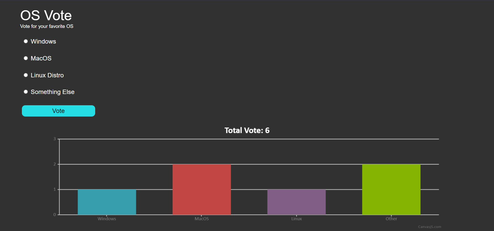

# Polly

A simple Poll Maker developed using Node.js and Pusher API.


## Installation 

1. Clone the Repository
```bash
 git clone https://github.com/Baboon12/Polly.git
```

2. Install dependencies

```bash
  npm install
```

3. For Running in Production Mode:
```bash 
  npm run start 
```

4. Go to Browser and type
```bash 
  127.0.0.1:3000 
```

## Environment Variables

To run this project, you will need to add the following environment variables to your .env file

`PORT`

`MONGO_URI`


## Screenshots

Web Layout

<br/> <br/> <br/>
Mobile Layout<br/>


## Tech Stack

**Client:** HTML, CSS

**Server:** Node, Express

**API:** Pusher - <a href="https://pusher.com/">https://pusher.com/</a>

  
